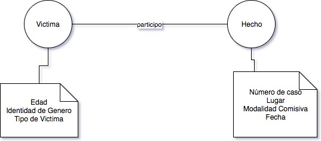

# Mapa Conceptual

Mapeo de datos existentes en diferentes organismos publicos en Argentina.

## Esquema de datos de feminicidios.

### Ministerio de justicia en Argentina

Campos:

* numero (int): número de caso
* edad (int): edad de la víctima
* identidad_genero (string): identidad de género
* tipo_victima (string): tipo de víctima (si se trata de un femicidio directo o vinculado)
* lugar_hecho (string): lugar del hecho
* modalidad_comisiva (string): modalidad comisiva
* fecha_hecho (date): fecha del hecho

### Jujuy

Organismos: 

* Policia local
* Ministerio público fiscal
* Justicia provincial
* Paridad de Genero
* Ministerio de Desarrollo Social

Campos:

* lugar y hora del hecho
* causales
* relaciones entre víctima y victimario
* datos de la víctima
* datos del victimario
* existencia de denuncias previas de violencia
* modalidad comitiva	

### La Rioja

Organismos

* Policia local
* Servicios de salud (hospital, centro de salud)
* ministerio público fiscal
* Justicia provincial	

Campos:

* lugar y hora del hecho
* causales
* relaciones entre víctima y victimario
* datos de la víctima
* datos del victimario
* existencia de denuncias previas de violencia
* modalidad comitiva

### Chubut

Organismos:

* ministerio público fiscal
* justicia provincial	

Campos:

* lugar y hora del hecho
* datos de la víctima
* datos del victimario
* existencia de denuncias previas de violencia
* causales y modalidad surgen del relato pero no hay campos especificos
